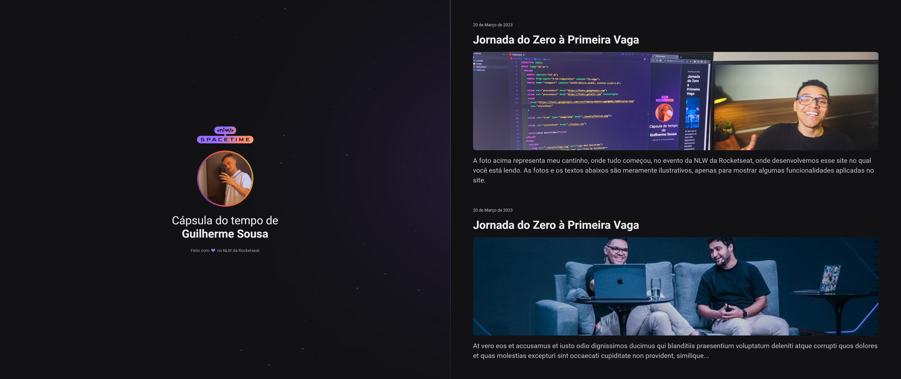

  

## 🖥️ Projeto
Esse  é um projeto Web Responsivo de uma cápsula do tempo para exibir memórias em uma timeline.

## 🚀 Tecnologias
Esse projeto  foi desenvolvido durante o NLW da Rocketseat com as seguintes tecnologias:

- HTML
- CSS
- Git e Github

## 🏷️ Layout
Você pode visualizar o layout do projeto através
[desse link](https://www.figma.com/file/67aJHuo0JCz1LpqmvIgSqB/C%C3%A1psula-do-tempo-%E2%80%A2-Trilha-Explorer?type=design&node-id=306%3A3&t=Lx6ebCBaE3H7Qdcx-1).
É necessário ter uma conta no [Figma](https://www.figma.com)